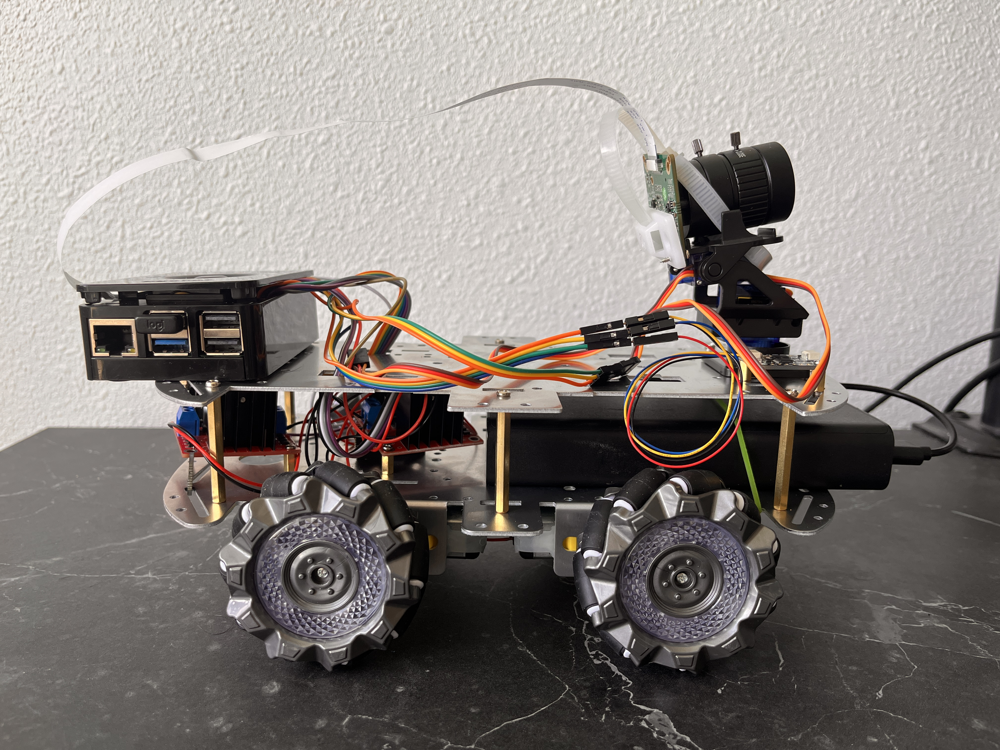

# R1

R1 is a Raspberry Pi 5-based Physical AI robot platform for experiments in robot perception, reasoning, and control. It uses ROS 2 to organize the system into modular software components.

<p align="center">
  
</p>

#### Goals

R1 is designed as a small, always-on research platform for testing embodied AI systems on real hardware. The platform focuses on:

- Perception: multi-camera sensing, object/face detection, and scene understanding
- Reasoning/AI: language-driven interpretation of visual events and robot state
- Control: modular action execution through ROS 2 nodes
- Observability: live monitoring through Foxglove, Prometheus, and Grafana
- Remote compute: offloading heavier AI workloads to a compute server when needed

The theory is mentioned here: projectnode1.github.io which is a comprehensive resource for understanding the underlying concepts.
This repository doesn't focus on writing out the concepts but more about implementing and running the R1 platform.

### Setup Instructions:

### ROS Instructions
```
# base setup
cd /home/ubuntu/r1
source /opt/ros/jazzy/setup.bash
source install/setup.bash

# to build
colcon build --symlink-install

# to delete current build
rm -rf build install log

# launch the nodes based bringup file
ros2 launch r1 bringup.launch.py \
  event_min_interval_sec:=5.0 \
  event_max_silence_sec:=5.0 \
  camera_uids:="[10]" \
  camera_labels:='["main"]' \
  yolo_camera_uid:=10 \
  enable_slam:=false \
  enable_web:=true \
  enable_ear:=false \
  enable_audio:=false \
  enable_vlm:=false \
  enable_2dobd:=false \
  enable_3dobd:=false \
  enable_detector:=false \
  enable_sampler:=false \
  enable_wheels:=true \
  enable_ptz:=true \
  enable_sensors:=true \
  gpio_chip:=4

# to launch foxglove_bridge
ros2 launch foxglove_bridge foxglove_bridge_launch.xml

# to run individual nodes
ros2 run r1 node_name
```

### Docker Instructions
```
# build docker container
docker build -t r1-ros .

# run the container
docker run --rm r1-ros date

docker run -it --rm \
  --name r1-ros \
  --user $(id -u):$(id -g) \
  --add-host=host.docker.internal:host-gateway \
  --group-add video \
  --device /dev/gpiochip0:/dev/gpiochip0 \
  --group-add $(getent group gpio | cut -d: -f3) \
  --device /dev/video10 \
  -p 8765:8765 \
  -p 8002:8002 \
  -v /home/murphy/Documents/r1:/home/ubuntu/r1 \
  r1-ros:latest

# to enter already running docker container  
docker exec -it r1-ros bash

# remove the container
docker rmi r1-ros
```

The wheel and PTZ controllers need `gpiozero` and GPIO device access. The Docker
command above exposes the `gpiochip` interface used on newer Raspberry Pi
systems. If your host also has `/dev/gpiomem`, you can add
`--device /dev/gpiomem:/dev/gpiomem`, but it is optional and should be omitted
when that device file does not exist. After changing the image or command,
rebuild, recreate the container, and source `install/setup.bash` before
launching. If the GPIO pins are exposed through `/dev/gpiochip4`, also pass
`--device /dev/gpiochip4:/dev/gpiochip4` and launch with `gpio_chip:=4`.
The Teleop panel reports the action-node execution result, so a
`200` response no longer looks like a motor success.

### Specific Nodes behaviors:

##### Audio Node and its bluetooth bridge:
```
# audio control
pactl list short sinks
pactl set-sink-volume bluez_output.41_42_12_84_8B_60.1 40%

# audio bridge controlling the bluetooth speaker from the host machine
chmod +x speaker_bridge.sh
apt update
apt install -y espeak alsa-utils
sudo apt install -y sox

ros2 topic pub --once /audio/heard_text std_msgs/msg/String "{data: 'how many cans are there and are of which brand? what about bottles?'}"

# run the speaker bridge in the host machine to forward audio from ROS to the bluetooth speaker
/home/murphy/Documents/r1/src/speaker_bridge.sh
```
##### Camera Node access
```
sudo apt install v4l2loopback-dkms v4l2loopback-utils ffmpeg

sudo modprobe v4l2loopback \
  video_nr=10 \
  card_label="R1 Camera" \
  exclusive_caps=1

v4l2-ctl --list-devices

rpicam-vid \
  -t 0 \
  --width 1280 \
  --height 720 \
  --framerate 30 \
  --codec yuv420 \
  -o - \
| ffmpeg \
    -f rawvideo \
    -pixel_format yuv420p \
    -video_size 1280x720 \
    -framerate 30 \
    -i - \
    -f v4l2 \
    -pix_fmt yuv420p \
    /dev/video10

```

##### VLM Node:

```
ollama run moondream # on the host
ollama serve
```

#### Foxglove Visualization
```
ros2 launch foxglove_bridge foxglove_bridge_launch.xml
```

#### R1 Compute Server

There is need for a remote server that handle computational loads for R1 that are bigger than what the R1 can handle locally.

#### R1 System Monitor

We setup Grafana and Prometheus to monitor the system. It allows us to visualize the system's performance and identify potential issues. 

### References:
- ROS 2 documentation: https://docs.ros.org/
- https://github.com/apple/ml-cubifyanything
- https://arxiv.org/abs/2005.14165
- https://arxiv.org/abs/2203.02155
- https://arxiv.org/pdf/2412.16720
- https://github.com/karpathy/autoresearch
- https://github.com/facebookresearch/dinov3
